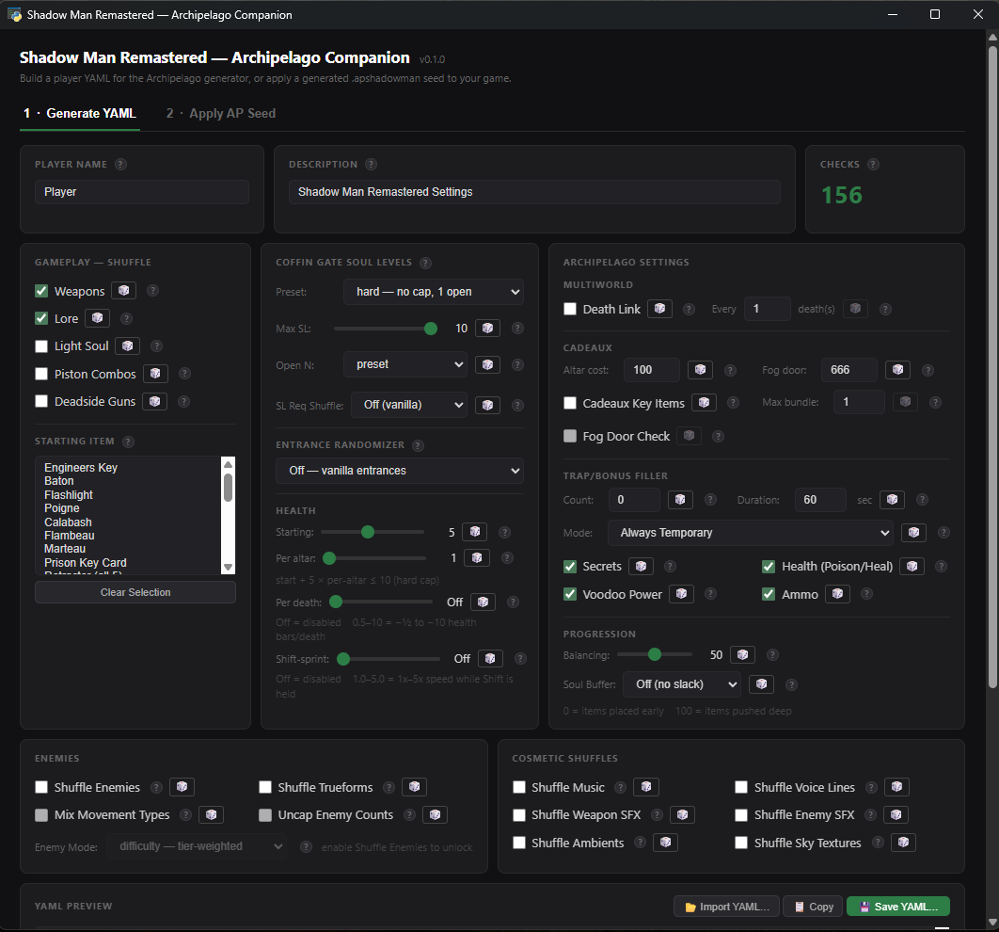
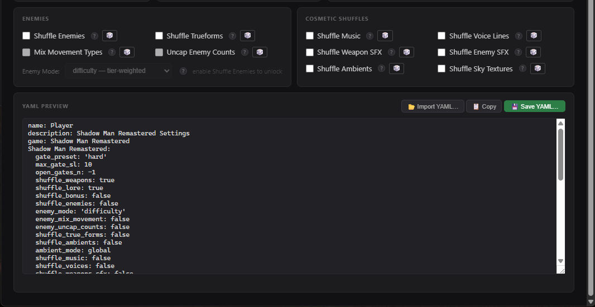
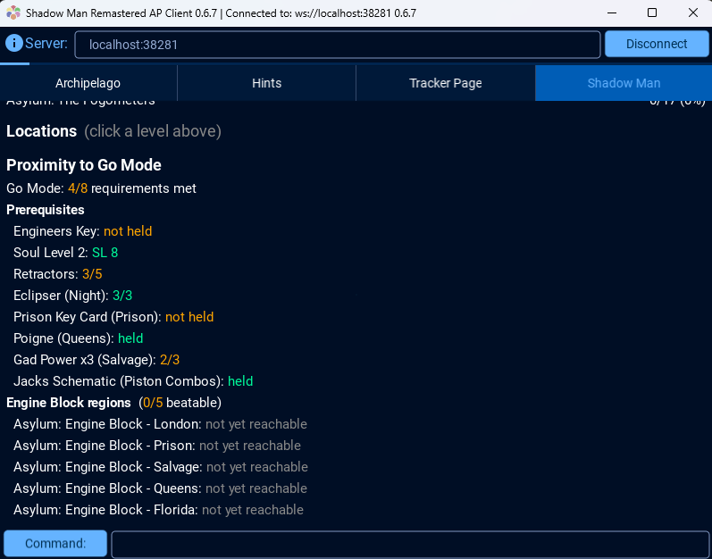

# Shadow Man Remastered Setup Guide

Game: Shadow Man Remastered (Steam)

## Goal

Defeat Legion. Reaching him requires collecting enough Dark Souls to open
the coffin gates blocking Deadside progress and completing the five Engine
Blocks (or, if `piston_combos` is enabled, also finding and reading Jack's
Schematic to learn that seed's randomized piston combination). Your client
reports `goal complete` automatically the moment Legion is confirmed dead —
no manual `!goal` needed.

## Installation

1. Install Archipelago.
2. Get a player YAML for this game. You can write one by hand (see
   `options.py` in this world for every available setting, or the
   Archipelago website's YAML generator), or use the Shadow Man Remastered
   AP Companion tool (`ap_gui.py` in the shadow-man-remastered-randomizer
   repo — "Generate YAML" tab) for a GUI with tooltips for every option and
   a live YAML preview as you toggle things:

   
   
3. Submit your YAML to the room you're generating (AP website multiworld
   generator, or your own local `Generate.py` run) like any other AP game.
   No local game install is needed for this step.
4. After generation, download your output zip and find the file named
   `AP_<seed>_P<n>_<yourname>.apshadowman` inside it. This is a small JSON
   file — safe to share, contains no game files, just your placement data.
5. Install the shadow-man-remastered-randomizer repo locally (this is where
   the actual game patching happens) and run:

   ```
   python apply_ap_seed.py path/to/your.apshadowman --game-dir "C:/path/to/Shadow Man Remastered"
   ```

   or use the AP Companion tool's "Apply AP Seed" tab, which wraps the same
   script with a file picker:

   
6. This patches your local copy: writes a `thoth_x64_patched.exe`, installs
   a mod KPF, and writes a spoiler log / object map / soul threshold JSON
   into `<game-dir>/randomizer_output`. Launch `thoth_x64_patched.exe` (not
   the vanilla exe) to play your seed.
7. Connect with the Archipelago client as usual once in-game. AP location
   checks use a custom "Book of AP" item model in-world, distinct from
   vanilla pickups:

   

You can re-run step 5 any time — it always re-patches from the same
`.apshadowman` file, so nothing is lost if you reinstall or verify game
files through Steam.

## A few settings worth knowing about

- `gate_preset`: controls coffin gate soul requirements
  (story/easy/medium/hard/chaos).
- `entrance_mode`: `deadside_only` shuffles which of the 9 Deadside portals
  leads to which level.
- `piston_combos`: randomizes the Dark Engine piston combinations; when on,
  Jack's Schematic becomes required to learn them before reaching the final
  boss.
- `insanity` ("Cadeaux Key Items"): off (default) excludes all ~657
  cadeaux (statue/altar) locations from the AP location pool entirely —
  same treatment as barrels, no checks, no hints, no "Cadeaux" item in the
  pool. On makes all of them real AP checks with no item-type restriction
  (any item, including other players' key items, can land there). Soul/Govi
  altar slots are unaffected either way — they've always been eligible for
  any item.
- `game_dir` no longer exists as an option — generation never touches your
  local game files directly. All local patching happens in the separate
  `apply_ap_seed.py` step above, regardless of whether you generated on the
  AP website or locally.

See `options.py` for the full list and detailed docstrings on every
setting.

## Tracking your progress

The Shadow Man AP client's own "Shadow Man" tab shows your overall status
(level, locations checked, Dark Souls/Soul Level, Cadeaux, Gad Powers,
health, Death Link) plus a per-level completion breakdown:


Scroll down on that same tab for "Proximity to Go Mode" — a checklist of
your remaining goal prerequisites and live Engine Block region
reachability, so you can see exactly what's standing between you and
Legion:



The client also has full [Universal Tracker](https://github.com/FarisTheAce/UniversalTracker)
integration when its apworld is installed alongside this one — a "Tracker
Page" tab listing every location and whether it's currently in logic:


